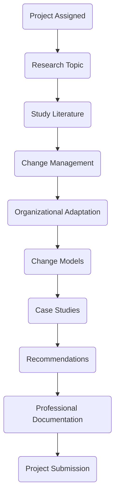

<div align="center">


# 📘 CHANGE MANAGEMENT AND ORGANIZATIONAL ADAPTATION

### **Project Proposal**


---

## 🏛 University of the Punjab

### Punjab University College of Information Technology (PUCIT)

### Department of Information Technology

---

# Submitted By

## **Talha Yaseen**

### **Roll Number:** BITF24M041

---

### Submitted To

## **Mam Anam**

*Course Instructor*

</div>

---

# 🌟 Project Overview

<div align="justify">

Modern organizations face continuous challenges due to technological innovation, digital transformation, globalization, Artificial Intelligence (AI), automation, changing customer expectations, and competitive markets.

To survive and remain competitive, organizations must effectively manage change while ensuring employees, processes, leadership, and organizational culture adapt successfully.

This project presents an in-depth study of **Change Management and Organizational Adaptation**, covering internationally recognized models, practical challenges, leadership strategies, organizational culture, employee resistance, and real-world business case studies.

The project has also been professionally documented using modern GitHub documentation practices to improve readability, visualization, and learning experience.

</div>

---

# 🎯 Project Objectives

<table>
<tr>
<th width="50%">Objective</th>
<th>Description</th>
</tr>

<tr>
<td>📖 Understand Change Management</td>
<td>Study the concept, purpose and importance of managing organizational change.</td>
</tr>

<tr>
<td>🏢 Organizational Adaptation</td>
<td>Understand how organizations adjust to internal and external environmental changes.</td>
</tr>

<tr>
<td>📊 Change Models</td>
<td>Study Lewin, Kotter and ADKAR frameworks.</td>
</tr>

<tr>
<td>👨‍💼 Leadership</td>
<td>Understand leadership responsibilities during organizational transformation.</td>
</tr>

<tr>
<td>👨‍👩‍👧 Employee Behaviour</td>
<td>Study resistance to change and methods to overcome it.</td>
</tr>

<tr>
<td>🌎 Case Studies</td>
<td>Analyze Microsoft and Kodak transformation journeys.</td>
</tr>

<tr>
<td>💻 Documentation</td>
<td>Create a professional GitHub README using Markdown, HTML and diagrams.</td>
</tr>

</table>

---

# 📚 Scope of the Project

This project covers the following major topics.

| ✔ Included Topics |
|-------------------|
| Introduction |
| Organizational Adaptation |
| Types of Organizational Change |
| Lewin Model |
| Kotter Model |
| ADKAR Model |
| Employee Resistance |
| Leadership |
| Organizational Culture |
| Challenges |
| Practical Solutions |
| Microsoft Case Study |
| Kodak Case Study |
| Recommendations |
| Conclusion |
| References |

---

# 🛠 Technologies Used

Although this is a management project, modern documentation technologies were used to create a professional presentation.

| Technology | Purpose |
|------------|----------|
| Markdown | Documentation |
| HTML | Advanced Formatting |
| Mermaid.js | Flowcharts |
| GitHub Tables | Information Display |
| Shields.io | Professional Badges |
| Emojis | Better Visualization |
| GitHub Markdown | Repository Documentation |

---

# 🎨 Documentation Features

<div align="center">

| Feature | Included |
|---------|----------|
| 🎨 Beautiful Layout | ✅ |
| 🌈 Professional Color Theme | ✅ |
| 📊 Tables | ✅ |
| 📈 Flowcharts | ✅ |
| 📚 Organized Sections | ✅ |
| 🧩 HTML Components | ✅ |
| 💻 GitHub Compatible | ✅ |
| 📱 Responsive Layout | ✅ |

</div>

---

# 📈 Project Workflow

```text
Research
    │
    ▼
Collect Information
    │
    ▼
Study Change Models
    │
    ▼
Analyze Case Studies
    │
    ▼
Prepare Documentation
    │
    ▼
Design GitHub README
    │
    ▼
Final Project Submission
```

---

# 🔄 Project Flow Diagram



---

# 📖 Research Methodology

<table>

<tr>
<th>Phase</th>
<th>Activities</th>
</tr>

<tr>
<td>Literature Review</td>
<td>Books, Journals and Articles</td>
</tr>

<tr>
<td>Analysis</td>
<td>Study Organizational Models</td>
</tr>

<tr>
<td>Case Study</td>
<td>Microsoft & Kodak</td>
</tr>

<tr>
<td>Documentation</td>
<td>Markdown + HTML</td>
</tr>

<tr>
<td>Presentation</td>
<td>GitHub Repository</td>
</tr>

</table>

---

# 📦 Deliverables

- ✅ Complete Research Report
- ✅ Professional README
- ✅ Tables
- ✅ Flowcharts
- ✅ Organizational Models
- ✅ Case Studies
- ✅ References
- ✅ Recommendations
- ✅ GitHub Documentation

---

# 🎓 Expected Learning Outcomes

After completing this project, the following knowledge and skills were gained.

| Technical Skills | Management Skills |
|-----------------|-------------------|
| GitHub Documentation | Change Management |
| Markdown | Leadership |
| HTML | Organizational Culture |
| Mermaid Diagrams | Strategic Planning |
| Documentation Design | Employee Motivation |
| Professional Reporting | Organizational Adaptation |

---

# 📅 Project Information

| Field | Details |
|--------|---------|
| 📖 Subject | Introduction to Management |
| 📝 Topic | Change Management and Organizational Adaptation |
| 👨‍🏫 Instructor | Mam Anam |
| 🏛 University | University of the Punjab |
| 🏢 Department | PUCIT |
| 👨‍🎓 Student | Talha Yaseen |
| 🆔 Roll Number | BITF24M041 |
| 📆 Semester | 4nd Semester |

---

# ✨ Declaration

> I hereby declare that this project titled **"Change Management and Organizational Adaptation"** has been completed as part of the coursework for **Introduction to Management**.

> The information presented in this project is based on research from authentic academic resources and has been organized, analyzed, and documented professionally.

---

# 🙏 Acknowledgement

I would like to express my sincere gratitude to **Mam Anam** for her valuable guidance, encouragement, and continuous support throughout this project.

Her teaching and constructive feedback greatly contributed to understanding the practical concepts of Change Management and Organizational Adaptation.

I also acknowledge the authors, researchers, and organizations whose publications have been used as references while preparing this report.

---

<div align="center">

# 💙 Thank You


---

### ⭐ University of the Punjab ⭐

### Punjab University College of Information Technology

### Department of Information Technology

</div>
