<div align="center">


### Introduction to Management Project


<br>


</div>

---

## 📖 Table of Contents

<details open>
<summary><b>Click to expand / collapse</b></summary>

- [🏢 University Information](#uni-info)
- [👨‍💻 Group Members](#group)
- [📖 About This Project](#about)
- [🌍 What is Change Management?](#what-is-cm)
- [🎯 Why Organizational Adaptation Matters](#why-matters)
- [🔄 Complete Change Management Cycle](#cm-cycle)
- [🎯 Traditional vs Adaptive Organization](#trad-vs-adaptive)
- [📊 Organizational Adaptation Process](#adaptation-process)
- [🔄 Types of Organizational Change](#types-of-change)
- [📈 Types of Change Diagram + Quadrant Analysis](#types-diagram)
- [🌟 Lewin's Change Management Model](#lewin)
- [🚀 Kotter's 8-Step Change Management Model](#kotter)
- [🌟 The ADKAR Model](#adkar)
- [⚖️ Lewin vs Kotter vs ADKAR](#model-comparison)
- [👥 Employee Resistance to Change](#resistance)
- [🏆 Role of Leadership in Change Management](#leadership)
- [🌍 Organizational Culture & Adaptation](#culture)
- [⚠️ Challenges in Organizational Change](#challenges)
- [📚 Case Study 1 — Microsoft](#case-microsoft)
- [📉 Case Study 2 — Kodak](#case-kodak)
- [🎬 Bonus Case Snapshot — Netflix](#case-netflix)
- [💡 Recommendations](#recommendations)
- [🎯 Key Takeaways](#key-takeaways)
- [🏁 Conclusion](#conclusion)
- [📚 References](#references)
- [📘 Glossary of Key Terms](#glossary)
- [❓ Exam & Presentation Q&A](#qa)
- [🏆 Tips for a Strong Presentation](#tips)
- [🧭 How to Use This Repository](#howto)
- [🛠 Technologies & Concepts Covered](#tech)
- [📜 License](#license)
- [🙏 Acknowledgements](#ack)
- [👨‍💻 Author](#author)
- [⭐ Support the Project](#support)

</details>

---

<a id="uni-info"></a>
## 🏢 University Information

| Item | Details |
|------|---------|
| 🎓 University | University of the Punjab |
| 🏛 Department | Punjab University College of Information Technology (PUCIT) |
| 📚 Subject | Introduction to Management |
| 📝 Topic | Change Management and Organizational Adaptation |
| 👩‍🏫 Instructor | Mam Anam |

<div align="right"><a href="#top">⬆️ Back to Top</a></div>

---

<a id="group"></a>
## 👨‍💻 Group Members

| Name | Roll Number |
|------|-------------|
| Talha Yaseen | BITF24M041 |
| Abdul Manan | BITF24M040 |
| Saad Nadeem | BITF24M052 |
| Muhammad Haroon | BITF24M018 |
| Anosh Khan | BITF24M054 |

<div align="right"><a href="#top">⬆️ Back to Top</a></div>

---

<a id="about"></a>
## 📖 About This Project

> This repository is the complete report for our **Introduction to Management** group project on **Change Management & Organizational Adaptation**, submitted at **PUCIT, University of the Punjab** under **Mam Anam**.

It walks through why organizations change, the three major frameworks used to manage that change — **Lewin's Model**, **Kotter's 8 Steps**, and **ADKAR** — how employees resist change and how leaders overcome that resistance, and two real-world case studies (**Microsoft's** successful transformation vs. **Kodak's** costly hesitation) that show exactly what's at stake when a company gets this right or wrong.

<div align="right"><a href="#top">⬆️ Back to Top</a></div>

---

<a id="what-is-cm"></a>
## 🌍 What is Change Management?

> Change Management is the structured process of preparing, supporting, implementing, and helping individuals adapt to organizational change successfully.

Organizations today face continuous changes due to:

- 🌐 Digital Transformation
- 🤖 Artificial Intelligence
- 📈 Market Competition
- 👥 Customer Expectations
- 💻 Technology Evolution
- 🏢 Organizational Restructuring

Without proper planning, change creates:

❌ Confusion

❌ Resistance

❌ Low Productivity

❌ Financial Loss

With proper management, organizations gain:

✅ Growth

✅ Innovation

✅ Employee Satisfaction

✅ Better Performance

<div align="right"><a href="#top">⬆️ Back to Top</a></div>

---

<a id="why-matters"></a>
## 🎯 Why Organizational Adaptation Matters

Organizational Adaptation means the ability of a company to adjust its:

- Structure
- Technology
- Employees
- Culture
- Business Strategy

to survive changing environments.

### 🚀 Benefits

| Benefit | Description |
|---------|-------------|
| 📈 Business Growth | Improves long-term success |
| 💻 Technology Adoption | Keeps organization competitive |
| 🤝 Better Employee Performance | Employees become more productive |
| 😊 Customer Satisfaction | Better products and services |
| ⚡ Fast Decision Making | Respond quickly to market changes |
| 💡 Innovation | Encourages creativity |

<div align="right"><a href="#top">⬆️ Back to Top</a></div>

---

<a id="cm-cycle"></a>
## 🔄 Complete Change Management Cycle

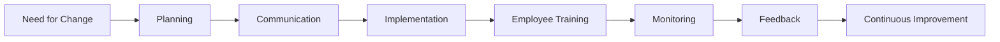

<div align="right"><a href="#top">⬆️ Back to Top</a></div>

---

<a id="trad-vs-adaptive"></a>
## 🎯 Traditional Organization vs Adaptive Organization

| Area | Traditional Organization | Adaptive Organization |
|------|-------------------------|-----------------------|
| Decision Making | Slow | Fast |
| Structure | Rigid | Flexible |
| Technology | Reactive | Proactive |
| Employees | Follow Instructions | Share Ideas |
| Innovation | Low | High |
| Market Response | Late | Early |
| Leadership | Command Based | Collaborative |
| Growth | Limited | Continuous |

<div align="right"><a href="#top">⬆️ Back to Top</a></div>

---

<a id="adaptation-process"></a>
## 📊 Organizational Adaptation Process

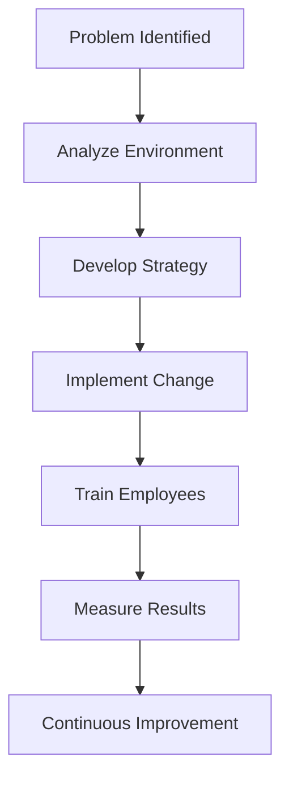

<details>
<summary><b>📌 Original quick-reference diagram (as originally drafted)</b></summary>

```text
Problem Identified
        │
        ▼
Analyze Environment
        │
        ▼
Develop Strategy
        │
        ▼
Implement Change
        │
        ▼
Train Employees
        │
        ▼
Measure Results
        │
        ▼
Continuous Improvement
```

</details>

> 🌟 **Key Learning**: Change is **not simply introducing a new policy or technology.** It is helping **people understand, accept, and sustain the change**.

<div align="right"><a href="#top">⬆️ Back to Top</a></div>

---

<a id="types-of-change"></a>
## 🔄 Types of Organizational Change

Organizations experience different types of change depending upon their goals, market conditions, technology, and customer needs. Each type affects different areas of the business.

### 📊 Overview

| 🔹 Change Type | 📖 Description | 🎯 Objective |
|---------------|---------------|--------------|
| 🏢 Structural Change | Changes in departments, reporting hierarchy, or organizational structure | Improve efficiency |
| 💻 Technological Change | Adoption of new software, AI, automation, or machinery | Increase productivity |
| 🎯 Strategic Change | Changes in business goals, mission, or long-term direction | Stay competitive |
| 🤝 Cultural Change | Changes in values, beliefs, and workplace behavior | Build positive work culture |
| 👨‍💼 People Change | Employee training, leadership development, and skill improvement | Better workforce performance |

### 🏢 1. Structural Change

Structural change modifies the internal framework of an organization.

Examples include:
- Creating new departments
- Merging teams
- Changing reporting hierarchy
- Introducing new management positions

**✅ Advantages:** Better communication · Faster decisions · Clear responsibilities · Improved coordination

**⚠ Challenges:** Employee uncertainty · Role confusion · Temporary productivity loss

### 💻 2. Technological Change

Technology is one of the biggest reasons organizations change today.

Examples include: Artificial Intelligence · Cloud Computing · ERP Systems · Automation · Digital Banking · CRM Software

**Benefits:** ✅ Faster work · ✅ Reduced errors · ✅ Better customer experience · ✅ Higher efficiency

### 🎯 3. Strategic Change

Strategic change changes the future direction of an organization. It includes: New Mission · New Vision · New Business Model · Entering New Markets · Digital Transformation

> **Example:** Netflix changed from DVD Rental to Online Streaming. *(See the [bonus Netflix snapshot](#case-netflix) below for the full story.)*

### 🤝 4. Cultural Change

Culture refers to the shared beliefs and values inside an organization. Cultural change focuses on improving: Employee mindset · Collaboration · Innovation · Ethics · Communication

### 👨‍💼 5. People Change

Organizations invest in people through: Employee Training · Leadership Development · Workshops · Team Building · Performance Improvement

Without employee development, organizational change often fails.

<div align="right"><a href="#top">⬆️ Back to Top</a></div>

---

<a id="types-diagram"></a>
## 📈 Types of Change Diagram + Quadrant Analysis

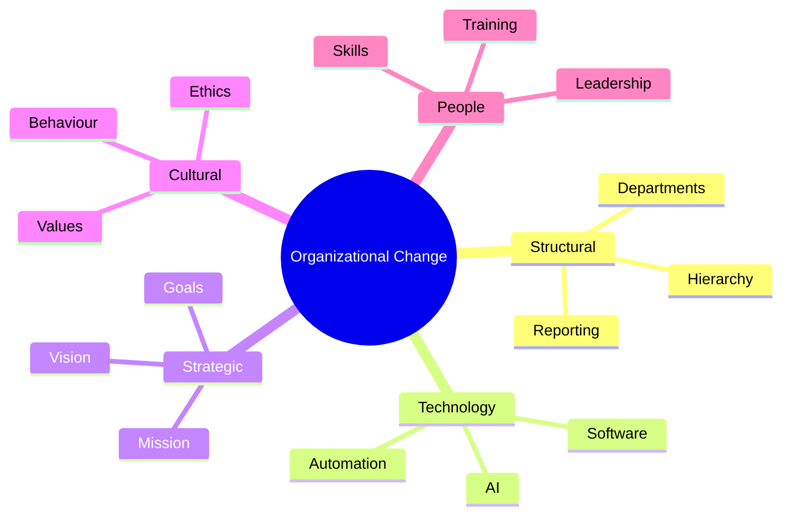

### 🔄 Complete Organizational Change Flow

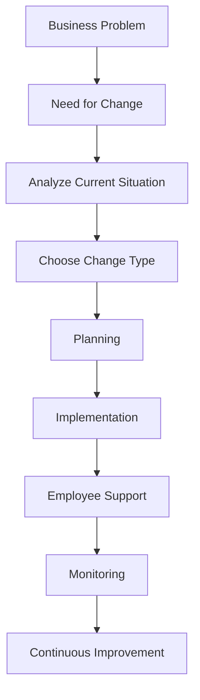

### ⚖ Comparison of Change Types

| Change | Difficulty | Cost | Time Required | Employee Impact |
|---------|-----------|------|---------------|-----------------|
| Structural | ⭐⭐⭐ | Medium | Medium | High |
| Technology | ⭐⭐⭐⭐ | High | High | High |
| Strategic | ⭐⭐⭐⭐⭐ | High | Long | Very High |
| Cultural | ⭐⭐⭐⭐⭐ | Medium | Long | Very High |
| People | ⭐⭐ | Low | Medium | Medium |

### 🧭 Same Data, Visualized — Difficulty vs. Employee Impact

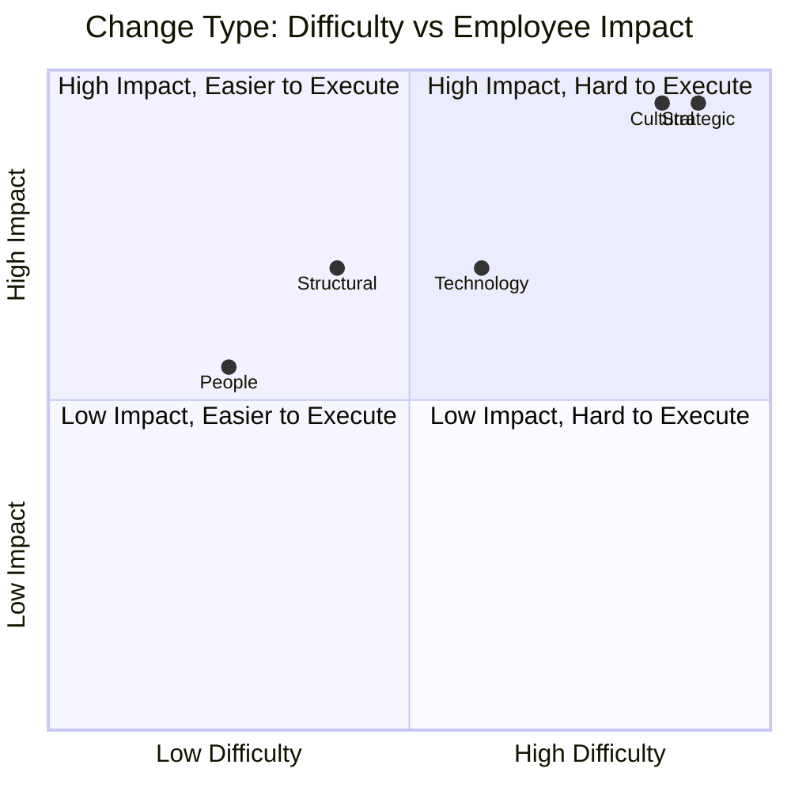

> 💡 Notice how **Strategic** and **Cultural** changes cluster in the top-right — hardest to execute *and* highest employee impact. That's exactly why both Microsoft's and Kodak's stories (below) center on strategic and cultural change, not just new tools.

<div align="right"><a href="#top">⬆️ Back to Top</a></div>

---

<a id="lewin"></a>
## 🌟 Lewin's Change Management Model

> Developed by **Kurt Lewin**, this is one of the earliest and most influential models of change management. The model explains that successful organizational change occurs in **three stages**.

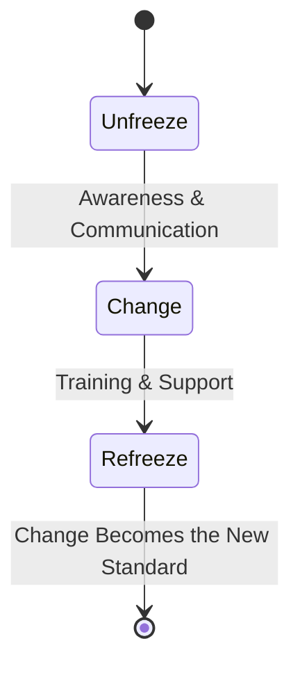

### 🧊 Stage 1 — Unfreeze

Before introducing change, organizations must prepare employees. The goal is to remove old habits and create awareness.

**Activities:** Explain why change is necessary · Reduce uncertainty · Communicate openly · Build trust · Encourage participation

**Without Unfreezing:** ❌ Resistance increases · ❌ Employees remain comfortable with old systems · ❌ New ideas are rejected

### 🔄 Stage 2 — Change

This is the implementation stage. Employees begin adopting new systems, tools, and working methods.

**Activities:** Training · Workshops · New Software · Process Improvement · Leadership Support

During this stage, employees require continuous guidance.

### ❄ Stage 3 — Refreeze

The final stage ensures that change becomes permanent. Organizations stabilize the new process by: Updating policies · Rewarding employees · Continuous monitoring · Performance evaluation

**Without Refreezing:** Employees usually return to their old habits.

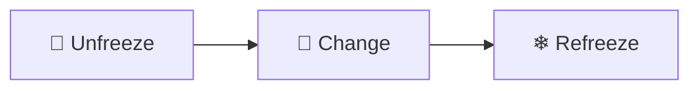

### 📋 Lewin Model Explained

| Stage | Purpose | Key Activities |
|--------|----------|----------------|
| 🧊 Unfreeze | Prepare employees | Communication, Awareness, Motivation |
| 🔄 Change | Implement improvements | Training, Support, Implementation |
| ❄ Refreeze | Sustain improvements | Rewards, Policies, Monitoring |

### 💡 Practical Example

Imagine a university introducing a new **Online Learning Management System (LMS).**

**🧊 Unfreeze** → Inform students and teachers · Explain benefits · Address concerns
**🔄 Change** → Install LMS · Conduct training sessions · Provide technical support
**❄ Refreeze** → Make LMS compulsory · Monitor usage · Reward active participation

### ⭐ Advantages of Lewin's Model

| ✔ Benefit | Explanation |
|------------|-------------|
| Simple | Easy to understand |
| Flexible | Suitable for many industries |
| Employee Focused | Reduces resistance |
| Proven | Used worldwide |

### ⚠ Limitations

| Drawback | Reason |
|----------|--------|
| Too Simple | Modern organizations face more complex changes |
| Slow Process | Large organizations require additional planning |
| Doesn't Address Continuous Change | Businesses today change constantly |

> 🎯 **Key Takeaway**: Successful organizational change does **not** begin with technology. It begins with **preparing people**, **supporting them during change**, and **reinforcing new behaviors** until they become the organization's new standard.

<div align="right"><a href="#top">⬆️ Back to Top</a></div>

---

<a id="kotter"></a>
## 🚀 Kotter's 8-Step Change Management Model

> **Developed by John P. Kotter**, this model provides a practical roadmap for implementing successful organizational change. Unlike Lewin's simple three-stage approach, Kotter's framework divides change into **eight detailed steps**, making it highly suitable for large organizations and long-term transformation projects.

### 🌟 Why Kotter's Model?

Organizations often fail because they: ❌ Don't communicate enough · ❌ Ignore employee concerns · ❌ Rush implementation · ❌ Lack leadership commitment

Kotter's model solves these issues by creating a structured process that focuses on **people, leadership, communication, and culture**.

### 🗺 Complete 8-Step Journey

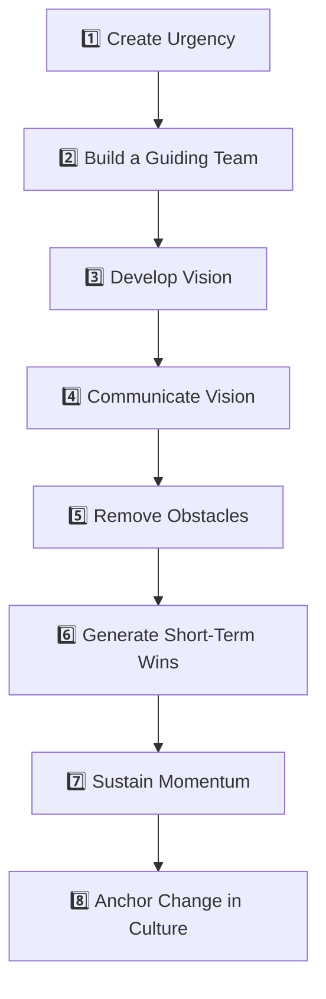

### 🗓️ Sample Illustrative Rollout Plan

*A hypothetical timeline showing how the 8 steps could be scheduled in a real rollout:*

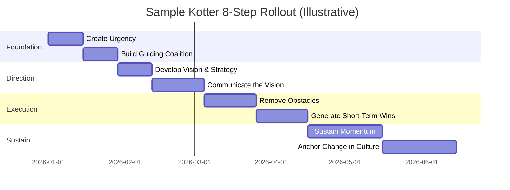

### 📋 Kotter's 8 Steps Explained

| Step | Objective | Description |
|------|-----------|-------------|
| 1️⃣ Create Urgency | Motivate change | Explain why change is necessary |
| 2️⃣ Build Coalition | Strong leadership | Form a team that supports change |
| 3️⃣ Create Vision | Clear direction | Define future goals |
| 4️⃣ Communicate Vision | Awareness | Share the vision with everyone |
| 5️⃣ Remove Barriers | Smooth implementation | Solve employee problems and resistance |
| 6️⃣ Short-Term Wins | Motivation | Celebrate small successes |
| 7️⃣ Maintain Momentum | Continuous improvement | Keep improving after early success |
| 8️⃣ Make it Permanent | Organizational Culture | Integrate change into daily operations |

<details open>
<summary><b>📍 Click to expand all 8 steps in detail</b></summary>

**📍 Step 1 — Create a Sense of Urgency**
Organizations must explain: Why change is needed · Risks of not changing · Benefits of acting now.
*Example: A bank explains that customers are moving toward digital banking. If the bank doesn't modernize, ➡ Customers will leave.*

**📍 Step 2 — Build a Guiding Coalition**
Successful change cannot depend on one person. Create a team including: Executives · Managers · Department Heads · Technical Experts · HR Professionals. Together they lead the transformation.

**📍 Step 3 — Develop Vision and Strategy**
A good vision should be: ✅ Simple ✅ Clear ✅ Inspiring ✅ Realistic
*Example: "Become Pakistan's leading AI-powered digital bank."*

**📍 Step 4 — Communicate the Vision**
Communication must be continuous. Methods include: Emails · Meetings · Workshops · Presentations · Company Portals. Employees should understand both ✔ Why change? and ✔ How change benefits them?

**📍 Step 5 — Remove Obstacles**
Common obstacles include: ❌ Fear ❌ Lack of skills ❌ Poor communication ❌ Outdated technology. Organizations should provide: Training · Technical support · Resources · Leadership guidance.

**📍 Step 6 — Generate Short-Term Wins**
People stay motivated when they see progress. Examples: 🏆 Complete first software module · 🏆 Train first 100 employees · 🏆 Reduce processing time. Celebrate these achievements.

**📍 Step 7 — Sustain Momentum**
Avoid celebrating too early. Instead: Continue improving · Collect feedback · Solve new problems · Expand successful initiatives.

**📍 Step 8 — Anchor Change into Culture**
The final goal is making change permanent. Organizations should update: Policies · Recruitment · Training · Performance Evaluation · Rewards. When new behaviors become habits, the change is complete.

</details>

### 📊 Kotter Model Summary

| Focus Area | Purpose |
|------------|----------|
| Leadership | Guide employees |
| Communication | Reduce confusion |
| Vision | Direction |
| Teamwork | Collaboration |
| Culture | Long-term success |

<div align="right"><a href="#top">⬆️ Back to Top</a></div>

---

<a id="adkar"></a>
## 🌟 The ADKAR Model

> Developed by **Jeff Hiatt**, the ADKAR Model focuses on **individual change** rather than organizational change. The idea is simple: **Organizations change only when people change.**

### 🔤 What Does ADKAR Stand For?

| Letter | Meaning |
|---------|----------|
| A | Awareness |
| D | Desire |
| K | Knowledge |
| A | Ability |
| R | Reinforcement |

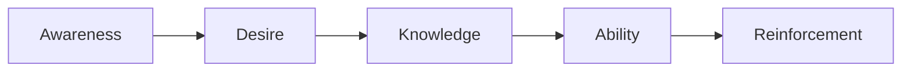

### 🥧 The 5 Pillars, Equally Weighted

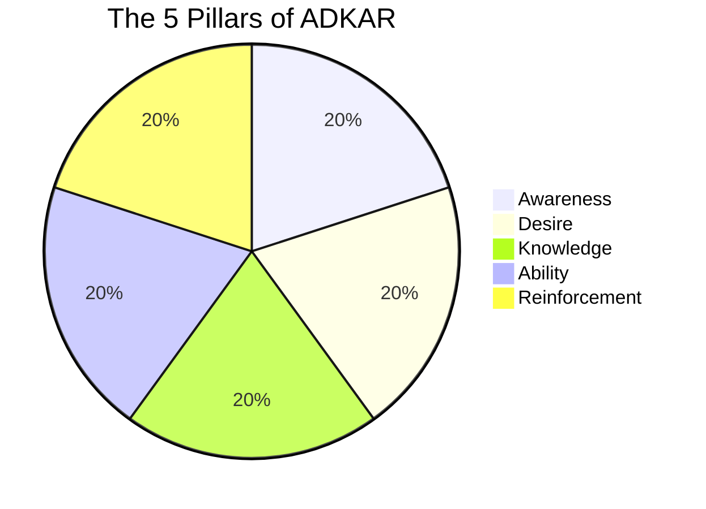

<details open>
<summary><b>🔤 Click to expand all 5 ADKAR stages in detail</b></summary>

**1️⃣ Awareness** — Employees must understand: Why change is happening · Why it matters · Risks of not changing. Without awareness, employees become confused.

**2️⃣ Desire** — Awareness alone isn't enough. Employees should personally want to support the change. Organizations create desire by: Motivation · Recognition · Involvement · Leadership Support.

**3️⃣ Knowledge** — Knowledge answers *"How do I perform the new work?"* Organizations provide: Training · Documentation · Workshops · Demonstrations.

**4️⃣ Ability** — Knowledge does not guarantee success. Employees must practice until they become confident. Examples: Hands-on labs · Simulations · Real projects · Mentoring.

**5️⃣ Reinforcement** — After implementation, organizations prevent employees from returning to old habits. Methods include: 🏆 Rewards · 📈 Performance Reviews · 🎯 Continuous Feedback · 🎓 Refresher Training.

</details>

### 📊 ADKAR Summary Table

| Stage | Goal | Organization Action |
|---------|------|--------------------|
| Awareness | Understand Change | Communication |
| Desire | Support Change | Motivation |
| Knowledge | Learn Skills | Training |
| Ability | Apply Skills | Practice |
| Reinforcement | Sustain Change | Rewards & Monitoring |

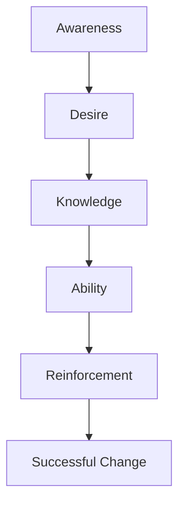

<div align="right"><a href="#top">⬆️ Back to Top</a></div>

---

<a id="model-comparison"></a>
## ⚖️ Lewin vs Kotter vs ADKAR

| Feature | Lewin | Kotter | ADKAR |
|-----------|--------|---------|--------|
| Developed By | Kurt Lewin | John Kotter | Jeff Hiatt |
| Stages | 3 | 8 | 5 |
| Complexity | Simple | Moderate | Moderate |
| Focus | Organization | Leadership | Individuals |
| Best For | Small Changes | Large Transformations | Employee Adoption |
| Popularity | ⭐⭐⭐⭐ | ⭐⭐⭐⭐⭐ | ⭐⭐⭐⭐⭐ |

### 🎯 Which Model Should Organizations Use?

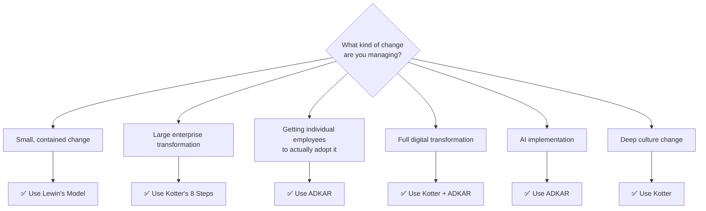

| Situation | Recommended Model |
|------------|------------------|
| Small organizational changes | Lewin |
| Enterprise transformation | Kotter |
| Employee behavioral change | ADKAR |
| Digital transformation | Kotter + ADKAR |
| AI implementation | ADKAR |
| Culture change | Kotter |

### 💡 Real-Life Example

Imagine a university implementing a new **AI-based Learning Management System (LMS).**

**Using Kotter:** Create urgency by explaining benefits → Form a project team → Develop a digital vision → Train faculty and students → Celebrate successful adoption → Integrate the LMS into university policy.

**Using ADKAR:** **Awareness** — explain why the LMS is needed · **Desire** — encourage participation through workshops · **Knowledge** — teach users how to use the LMS · **Ability** — provide hands-on practice · **Reinforcement** — monitor usage and reward active users.

> **Lewin** explains *how change begins*. **Kotter** explains *how organizations manage large-scale transformation*. **ADKAR** explains *how individuals successfully adopt change*. Together, these three models provide a complete framework for successful organizational adaptation.

<div align="right"><a href="#top">⬆️ Back to Top</a></div>

---

<a id="resistance"></a>
## 👥 Employee Resistance to Change

> Resistance to change is a **natural human reaction**. Employees often fear uncertainty, additional workload, job loss, or unfamiliar technologies. Organizations should not treat resistance as a problem but as valuable feedback that helps improve the change process.

### ❓ Why Do Employees Resist Change?

| Reason | Description |
|--------|-------------|
| 😨 Fear of Job Loss | Employees worry automation or AI may replace them |
| ❓ Uncertainty | Lack of information creates confusion and anxiety |
| 📚 Lack of Skills | Employees feel unprepared for new systems |
| 🔄 Comfort Zone | People naturally prefer familiar routines |
| 📢 Poor Communication | Employees don't understand the purpose of change |
| 💼 Increased Workload | Learning new processes requires additional effort |

### 📊 Resistance Process

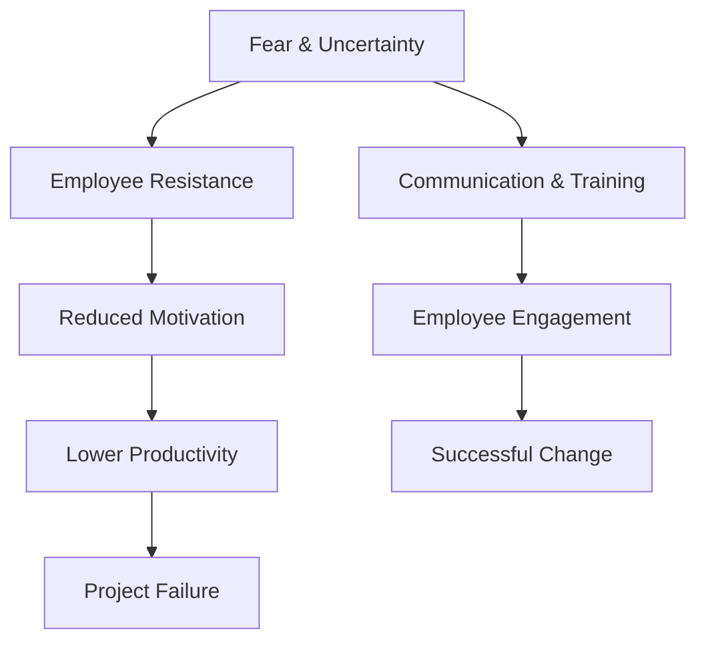

### 🔁 From Resistance to Adoption

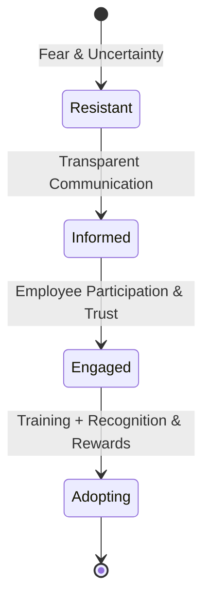

### ✅ Strategies to Overcome Resistance

✔ Transparent Communication ✔ Employee Participation ✔ Leadership Support ✔ Training Programs ✔ Continuous Feedback ✔ Recognition & Rewards

<div align="right"><a href="#top">⬆️ Back to Top</a></div>

---

<a id="leadership"></a>
## 🏆 Role of Leadership in Change Management

Leadership is one of the most critical factors in successful organizational transformation. Great leaders do more than approve plans — they inspire people, communicate vision, remove obstacles, and guide teams through uncertainty.

### 🌟 Responsibilities of Leaders

| Responsibility | Purpose |
|---------------|----------|
| 🎯 Set Vision | Define organizational direction |
| 📢 Communicate | Explain the purpose of change |
| 🤝 Build Trust | Reduce employee anxiety |
| 💰 Allocate Resources | Provide tools and support |
| 🎓 Encourage Learning | Promote employee development |
| 📈 Monitor Progress | Track organizational improvement |

### 👨‍💼 Leadership Flow

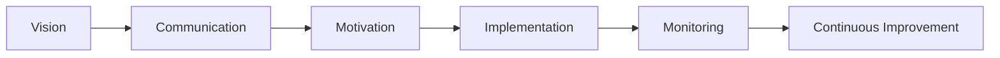

<div align="right"><a href="#top">⬆️ Back to Top</a></div>

---

<a id="culture"></a>
## 🌍 Organizational Culture & Adaptation

Organizational culture represents the shared: Values · Beliefs · Behaviors · Ethics · Work Practices. Culture strongly influences how employees respond to organizational change.

### 🌱 Healthy Organizational Culture

| Positive Culture | Negative Culture |
|------------------|------------------|
| Innovation | Resistance |
| Teamwork | Conflict |
| Learning | Fear |
| Collaboration | Isolation |
| Trust | Mistrust |
| Flexibility | Rigidity |

### 🏢 Culture Transformation

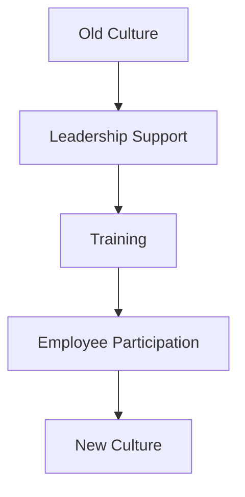

<div align="right"><a href="#top">⬆️ Back to Top</a></div>

---

<a id="challenges"></a>
## ⚠️ Challenges in Organizational Change

Organizations face many challenges while implementing change.

### 📋 Major Challenges

| Challenge | Impact |
|-----------|---------|
| Poor Communication | Confusion |
| Limited Budget | Delayed implementation |
| Lack of Leadership | Weak direction |
| Employee Resistance | Reduced productivity |
| Lack of Skills | Poor adoption |
| Weak Planning | Project failure |

### 💡 Practical Solutions

| Challenge | Solution |
|------------|----------|
| Employee Fear | Communication & Counseling |
| Skill Gap | Training Programs |
| Resource Limitations | Proper Budget Planning |
| Resistance | Employee Involvement |
| Poor Leadership | Leadership Development |
| Poor Monitoring | Continuous Evaluation |

### 📊 Challenge → Solution Flow

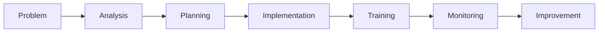

<div align="right"><a href="#top">⬆️ Back to Top</a></div>

---

<a id="case-microsoft"></a>
## 📚 Case Study 1 — Microsoft (Success Story) 🚀

> Microsoft is one of the world's best examples of successful organizational adaptation.

**📖 Background:** Microsoft was traditionally known for desktop software such as Windows and Microsoft Office. As technology shifted toward ☁ Cloud Computing, 📱 Mobile Platforms, 🤖 Artificial Intelligence, and 🔄 Subscription Services, the company needed to transform.

**❗ Problem:** Microsoft faced internal competition, slow innovation, a traditional mindset, and limited collaboration.

**💡 Change Strategy:** Under **Satya Nadella**, Microsoft focused on: ✅ Cloud Computing (Azure) ✅ Open-source collaboration ✅ Employee learning ✅ Growth mindset ✅ Customer-centric innovation

### 📈 Results

| Achievement | Outcome |
|------------|----------|
| Azure Expansion | Massive Cloud Growth |
| Company Culture | Improved Collaboration |
| Innovation | Increased Product Development |
| Market Value | Became one of the world's most valuable companies |

> 🎓 **Lesson Learned**: Successful transformation requires **technology, leadership, culture, and continuous learning**.

<div align="right"><a href="#top">⬆️ Back to Top</a></div>

---

<a id="case-kodak"></a>
## 📉 Case Study 2 — Kodak (Failure Story)

Kodak dominated the photography industry for decades. However, it failed to adapt quickly to digital technology.

**❗ Problem:** Although Kodak invented early digital camera technology, the company continued focusing on film photography. Management feared losing traditional profits.

**📉 Result:** Competitors adopted digital technology faster. Customer preferences changed. Kodak eventually filed for bankruptcy protection in **2012**.

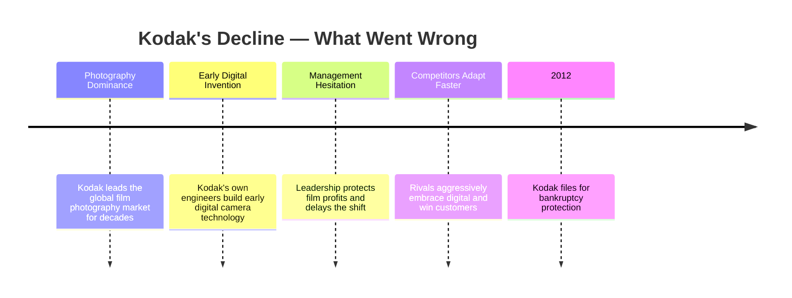

> 📚 **Lesson Learned**: Knowing change is coming is **not enough**. Organizations must act **early**, **quickly**, and **confidently**.

### ⚖ Microsoft vs Kodak

| Microsoft | Kodak |
|------------|--------|
| Adapted Quickly | Adapted Slowly |
| Invested in Cloud | Focused on Film |
| Encouraged Innovation | Protected Old Business |
| Growth Mindset | Fear of Change |
| Market Leader | Lost Competitive Advantage |

<div align="right"><a href="#top">⬆️ Back to Top</a></div>

---

<a id="case-netflix"></a>
## 🎬 Bonus Case Snapshot — Netflix

> This one wasn't in the original report as a full case study — just a single line under Strategic Change. It's worth a closer look because it's one of the clearest strategic-change stories out there.

Netflix started as a **DVD-by-mail rental service**, competing directly with brick-and-mortar video rental chains like Blockbuster. Rather than defend that business as broadband internet spread, Netflix made a deliberate strategic bet: it pivoted toward **online streaming**, and later into **producing its own original content** — reshaping itself from a distributor into a media company.

| Netflix's Approach | Why It Worked |
|----------------------|-----------------|
| Cannibalized its own DVD business early | Avoided being disrupted by someone else doing it first |
| Invested heavily in streaming infrastructure | Built a durable technology advantage |
| Moved into original content | Reduced dependence on licensing deals with rival studios |

> 🎓 **Lesson Learned**: The companies that survive strategic shifts are often the ones willing to disrupt their *own* profitable business before a competitor does it for them — the opposite of what Kodak chose to do.

<div align="right"><a href="#top">⬆️ Back to Top</a></div>

---

<a id="recommendations"></a>
## 💡 Recommendations

Organizations should:

- 📢 Communicate clearly
- 🎓 Invest in employee training
- 🤝 Encourage teamwork
- 📈 Monitor progress continuously
- 🏆 Celebrate small successes
- 💻 Embrace digital transformation
- 🤖 Adopt Artificial Intelligence responsibly
- 🌱 Build a positive organizational culture

<div align="right"><a href="#top">⬆️ Back to Top</a></div>

---

<a id="key-takeaways"></a>
## 🎯 Key Takeaways

> Successful organizational change depends on:

- Strong Leadership
- Employee Participation
- Continuous Learning
- Effective Communication
- Organizational Culture
- Technology Adoption
- Continuous Improvement

<div align="right"><a href="#top">⬆️ Back to Top</a></div>

---

<a id="conclusion"></a>
## 🏁 Conclusion

Change is no longer optional — it is essential for organizational survival and growth. Throughout this project, we explored:

- ✅ Change Management
- ✅ Organizational Adaptation
- ✅ Types of Change
- ✅ Lewin's Model
- ✅ Kotter's 8-Step Model
- ✅ ADKAR Model
- ✅ Employee Resistance
- ✅ Leadership
- ✅ Organizational Culture
- ✅ Challenges & Solutions
- ✅ Microsoft Success Story
- ✅ Kodak Failure Story

Organizations that embrace learning, innovation, communication, and adaptability are more likely to achieve sustainable success.

<div align="right"><a href="#top">⬆️ Back to Top</a></div>

---

<a id="references"></a>
## 📚 References

- Burnes, B. (2020). *Managing Change (8th Edition)*.
- Cameron, E., & Green, M. (2019). *Making Sense of Change Management (5th Edition)*.
- Hiatt, J. (2006). *ADKAR: A Model for Change in Business, Government and Our Community*.
- Kotter, J. P. (1996). *Leading Change*.
- Kotter, J. P. (2012). *Leading Change*.
- Microsoft Corporation. *Annual Report (2024)*.
- Moran, J. W., & Brightman, B. K. (2001). *Leading Organizational Change*.
- Schein, E. H. (2017). *Organizational Culture and Leadership (5th Edition)*.

<div align="right"><a href="#top">⬆️ Back to Top</a></div>

---

<a id="glossary"></a>
## 📘 Glossary of Key Terms

<details>
<summary><b>📌 Click to expand the full glossary (20+ terms)</b></summary>

| Term | Definition |
|------|-------------|
| **Change Agent** | A person who drives and champions change within an organization |
| **Change Curve** | A model describing the emotional stages people move through during change |
| **Change Fatigue** | Employee exhaustion from experiencing too much change too quickly |
| **Burning Platform** | A sense of urgency created by highlighting the risk of *not* changing |
| **Sponsorship** | Visible, active leadership support for a change initiative |
| **Stakeholder** | Anyone affected by or able to influence the change |
| **Organizational Inertia** | An organization's natural resistance to deviating from its current state |
| **Growth Mindset** | The belief that abilities can be developed through effort and learning |
| **Digital Transformation** | Integrating digital technology into all areas of a business |
| **Business Process Reengineering** | Radically redesigning core business processes for major performance gains |
| **Organizational Development (OD)** | A planned, systematic approach to improving organizational effectiveness |
| **Quick Win** | An early, visible success used to build momentum for change |
| **Culture Carrier** | An employee whose behavior strongly reinforces (or resists) the desired culture |
| **Unfreeze–Change–Refreeze** | Lewin's three-stage shorthand for the change process |
| **ADKAR** | Awareness, Desire, Knowledge, Ability, Reinforcement — Hiatt's individual change model |
| **Transformational Leadership** | A leadership style that inspires change through vision and motivation |
| **Servant Leadership** | A leadership style prioritizing the growth and wellbeing of the team |
| **Psychological Safety** | A shared belief that it's safe to take interpersonal risks within a team |
| **Change Readiness** | An organization's or individual's preparedness to accept and adopt change |
| **Resistance to Change** | Any employee behavior that opposes or slows down a change initiative |

</details>

<div align="right"><a href="#top">⬆️ Back to Top</a></div>

---

<a id="qa"></a>
## ❓ Exam & Presentation Q&A

<details>
<summary><b>🔹 General Concepts (5 Questions)</b></summary>
<br>

**Q: What is the difference between change management and organizational adaptation?**
Change management is the structured *process* of implementing a specific change; organizational adaptation is the broader, ongoing *capability* of a company to keep adjusting as its environment shifts.

**Q: Name the five types of organizational change.**
Structural, Technological, Strategic, Cultural, and People change.

**Q: Why is cultural change usually harder than structural change?**
Structural change alters reporting lines and departments — visible, procedural. Cultural change requires shifting shared beliefs and habits across an entire workforce, which takes far longer and is harder to enforce top-down.

**Q: What does "quick win" mean in a change initiative, and why does it matter?**
An early, visible success that proves the change is working — it builds momentum and credibility before the full transformation is complete.

**Q: Why should organizations treat resistance as feedback rather than a problem?**
Because resistance often highlights a real gap — poor communication, missing training, or a genuine flaw in the plan — that's worth fixing before pushing forward.

</details>

<details>
<summary><b>🔹 Lewin's Model (4 Questions)</b></summary>
<br>

**Q: What are Lewin's three stages, in order?**
Unfreeze → Change → Refreeze.

**Q: What happens if an organization skips the "Refreeze" stage?**
Employees tend to drift back to their old habits, and the change doesn't stick.

**Q: What is the main criticism of Lewin's Model?**
It's considered too simple for continuous, fast-moving change — it was designed for one-off, linear transformations, not the constant change many modern organizations face.

**Q: Give a one-line reason Lewin's Model is still popular despite its age.**
It's simple, flexible, and easy to apply across very different types of organizations.

</details>

<details>
<summary><b>🔹 Kotter's 8-Step Model (4 Questions)</b></summary>
<br>

**Q: Why does Kotter's model start with "Create Urgency" rather than "Develop a Vision"?**
Without urgency, employees have no reason to engage with a vision at all — urgency creates the motivation needed for every step that follows.

**Q: What's the risk of celebrating short-term wins too early or too loudly?**
Teams may believe the transformation is finished and lose momentum before the change is fully anchored (Step 7 exists specifically to guard against this).

**Q: How is Kotter's model different from Lewin's in terms of scale?**
Kotter's 8 steps are built for large, complex organizational transformations; Lewin's 3 stages suit smaller, more contained changes.

**Q: What does "anchoring change in culture" actually involve?**
Updating policies, recruitment, training, performance evaluation, and rewards so the new behavior becomes the default — not just a temporary initiative.

</details>

<details>
<summary><b>🔹 ADKAR Model (4 Questions)</b></summary>
<br>

**Q: What does each letter in ADKAR stand for?**
Awareness, Desire, Knowledge, Ability, Reinforcement.

**Q: Why does ADKAR focus on individuals instead of the whole organization?**
Because Hiatt's core premise is that organizations only change when the individual people inside them change — so the model is built around each employee's personal journey.

**Q: What's the difference between "Knowledge" and "Ability" in ADKAR?**
Knowledge is knowing *how* to do the new task; Ability is actually being able to perform it well under real conditions — the two aren't the same, and training alone only builds Knowledge.

**Q: When would ADKAR be a better fit than Kotter?**
When the challenge is getting individual employees to actually adopt a specific change (e.g., a new tool), rather than steering an entire organization through a large transformation.

</details>

<div align="right"><a href="#top">⬆️ Back to Top</a></div>

---

<a id="tips"></a>
## 🏆 Tips for a Strong Presentation

- 🎤 **Open with the Netflix or Kodak hook** — a real company story grabs attention faster than a definition slide
- 🧠 **Know the Lewin vs. Kotter vs. ADKAR comparison table cold** — it's the question every instructor asks first
- 🖊️ **Use the quadrant chart** to explain *why* strategic and cultural change are the hardest types to pull off
- 🔗 **Tie every recommendation back to a case study** — "communicate clearly" means more right after showing what happened at Kodak
- 📋 **Rehearse the 8 Kotter steps in order** — reciting them fluently signals real understanding, not memorization
- 🙋 **Prepare for "which model would you use for X?" questions** — practice with a few scenarios beyond the ones in this report

<div align="right"><a href="#top">⬆️ Back to Top</a></div>

---

<a id="howto"></a>
## 🧭 How to Use This Repository

```text
New to the topic?
        │
        ▼
Start with "What is Change Management?"
        │
        ▼
Read the Types of Change section
        │
        ▼
Study Lewin → Kotter → ADKAR in order (simple to complex)
        │
        ▼
Review Resistance, Leadership & Culture
        │
        ▼
Read Microsoft, Kodak & Netflix side by side
        │
        ▼
Revisit the Glossary + Q&A before your presentation or exam
```

<div align="right"><a href="#top">⬆️ Back to Top</a></div>

---

<a id="tech"></a>
## 🛠 Technologies & Concepts Covered

<p align="center">


</p>

<div align="right"><a href="#top">⬆️ Back to Top</a></div>

---

<a id="license"></a>
## 📜 License

This project is intended for *educational purposes only*. You are free to study, modify, and use the content for learning. If you reuse substantial parts of the project, please provide appropriate credit.

<div align="right"><a href="#top">⬆️ Back to Top</a></div>

---

<a id="ack"></a>
## 🙏 Acknowledgements

Special thanks to:

- Our Management Instructor
- FCIT Faculty
- Classmates and Team Members
- Everyone who provided feedback during development

<div align="right"><a href="#top">⬆️ Back to Top</a></div>

---

<a id="author"></a>
<div align="center">


## 👨‍💻 Author

## Talha Yaseen

*Roll: BITF24M041*

*BS Information Technology*

Management Final Project

2026

### Connect with Me

- 🌐 GitHub: **[github.com/Talha-Yaseen-Hub](https://github.com/Talha-Yaseen-Hub)**
- 💼 LinkedIn: **[linkedin.com/in/talha-yaseen](https://www.linkedin.com/in/talha-yaseen-44a41a341)**
- 📧 Email: **talhavectorarts@gmail.com**

<br>


</div>

<div align="right"><a href="#top">⬆️ Back to Top</a></div>

---

<a id="support"></a>
<div align="center">

# ⭐ Support the Project

If this project helped you learn Change Management or inspired your own work, consider giving it a ⭐ Star on GitHub.

Your support motivates me to continue building and sharing educational projects.

<br>

### ❤️ Thank You for Visiting

### 🌟 "Organizations that embrace change don't just survive — they lead the future."

<br>


</div>
