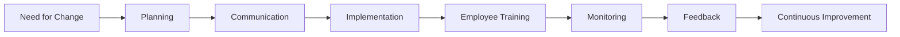
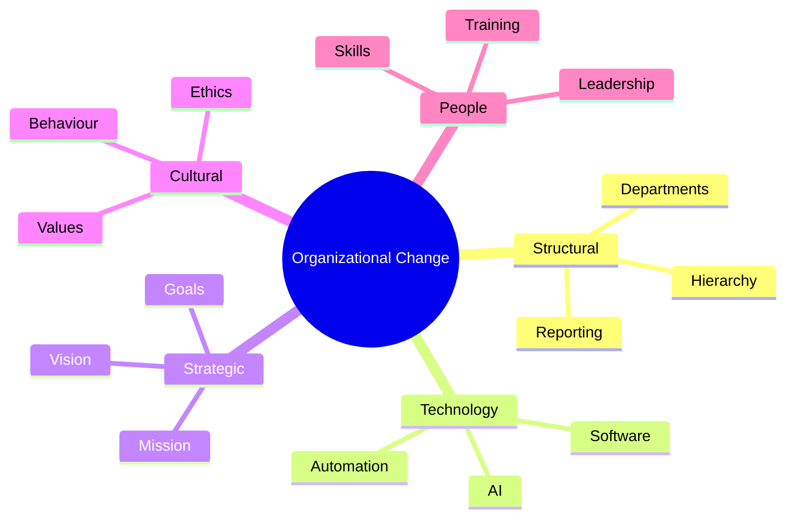
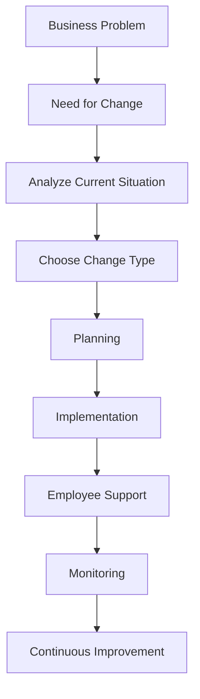
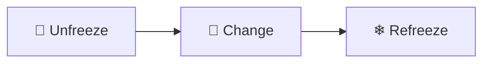
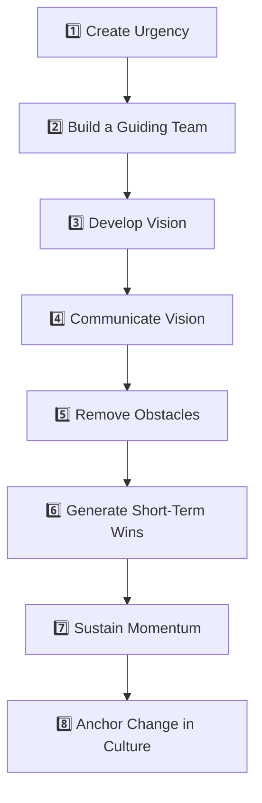
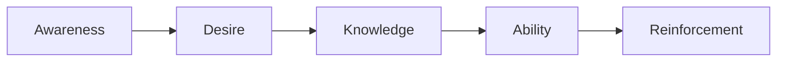
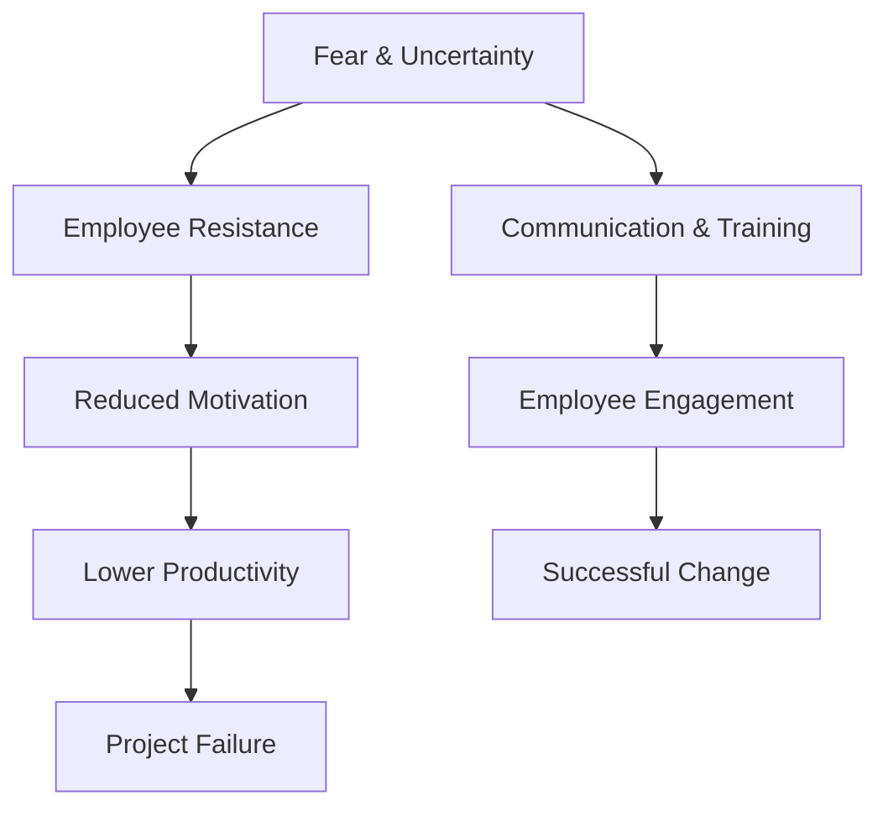
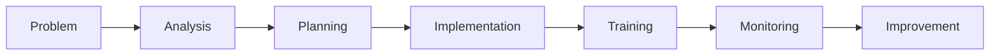

<div align="center">

# 📈 Change Management & Organizational Adaptation

### *Introduction to Management Project*


<br>


</div>

---

# 🏢 University Information

| Item | Details |
|------|---------|
| 🎓 University | University of the Punjab |
| 🏛 Department | Punjab University College of Information Technology (PUCIT) |
| 📚 Subject | Introduction to Management |
| 📝 Topic | Change Management and Organizational Adaptation |
| 👩‍🏫 Instructor | Mam Anam |

---

# 👨‍💻 Group Members

| Name | Roll Number |
|------|-------------|
| Talha Yaseen | BITF24M041 |
| Abdul Manan | BITF24M040 |
| Saad Nadeem | BITF24M052 |
| Muhammad Haroon | BITF24M018 |
| Anosh Khan | BITF24M054 |

---

# 📑 Table of Contents

- Introduction
- What is Change Management?
- Organizational Adaptation
- Types of Organizational Change
- Change Management Flow
- Lewin Model
- Kotter's 8-Step Model
- ADKAR Model
- Employee Resistance
- Leadership
- Organizational Culture
- Challenges & Solutions
- Case Studies
- Recommendations
- Conclusion
- References

---

# 🌍 What is Change Management?

> Change Management is the structured process of preparing, supporting, implementing, and helping individuals adapt to organizational change successfully.

Organizations today face continuous changes due to:

- 🌐 Digital Transformation
- 🤖 Artificial Intelligence
- 📈 Market Competition
- 👥 Customer Expectations
- 💻 Technology Evolution
- 🏢 Organizational Restructuring

Without proper planning, change creates:

❌ Confusion

❌ Resistance

❌ Low Productivity

❌ Financial Loss

With proper management, organizations gain:

✅ Growth

✅ Innovation

✅ Employee Satisfaction

✅ Better Performance

---

# 🎯 Why Organizational Adaptation Matters

Organizational Adaptation means the ability of a company to adjust its:

- Structure
- Technology
- Employees
- Culture
- Business Strategy

to survive changing environments.

---

## 🚀 Benefits

| Benefit | Description |
|---------|-------------|
| 📈 Business Growth | Improves long-term success |
| 💻 Technology Adoption | Keeps organization competitive |
| 🤝 Better Employee Performance | Employees become more productive |
| 😊 Customer Satisfaction | Better products and services |
| ⚡ Fast Decision Making | Respond quickly to market changes |
| 💡 Innovation | Encourages creativity |

---

# 🔄 Complete Change Management Cycle



---

# 🎯 Traditional Organization vs Adaptive Organization

| Area | Traditional Organization | Adaptive Organization |
|------|-------------------------|-----------------------|
| Decision Making | Slow | Fast |
| Structure | Rigid | Flexible |
| Technology | Reactive | Proactive |
| Employees | Follow Instructions | Share Ideas |
| Innovation | Low | High |
| Market Response | Late | Early |
| Leadership | Command Based | Collaborative |
| Growth | Limited | Continuous |

---

# 📊 Organizational Adaptation Process

```text
Problem Identified
        │
        ▼
Analyze Environment
        │
        ▼
Develop Strategy
        │
        ▼
Implement Change
        │
        ▼
Train Employees
        │
        ▼
Measure Results
        │
        ▼
Continuous Improvement
```

---

# 🌟 Key Learning

> Change is **not simply introducing a new policy or technology.**
>
> It is helping **people understand, accept, and sustain the change**.

---

# 🔄 Types of Organizational Change

Organizations experience different types of change depending upon their goals, market conditions, technology, and customer needs.

Each type affects different areas of the business.

---

## 📊 Overview

| 🔹 Change Type | 📖 Description | 🎯 Objective |
|---------------|---------------|--------------|
| 🏢 Structural Change | Changes in departments, reporting hierarchy, or organizational structure | Improve efficiency |
| 💻 Technological Change | Adoption of new software, AI, automation, or machinery | Increase productivity |
| 🎯 Strategic Change | Changes in business goals, mission, or long-term direction | Stay competitive |
| 🤝 Cultural Change | Changes in values, beliefs, and workplace behavior | Build positive work culture |
| 👨‍💼 People Change | Employee training, leadership development, and skill improvement | Better workforce performance |

---

# 🏢 1. Structural Change

Structural change modifies the internal framework of an organization.

Examples include:

- Creating new departments
- Merging teams
- Changing reporting hierarchy
- Introducing new management positions

### ✅ Advantages

- Better communication
- Faster decisions
- Clear responsibilities
- Improved coordination

### ⚠ Challenges

- Employee uncertainty
- Role confusion
- Temporary productivity loss

---

# 💻 2. Technological Change

Technology is one of the biggest reasons organizations change today.

Examples include:

- Artificial Intelligence
- Cloud Computing
- ERP Systems
- Automation
- Digital Banking
- CRM Software

### Benefits

✅ Faster work

✅ Reduced errors

✅ Better customer experience

✅ Higher efficiency

---

# 🎯 3. Strategic Change

Strategic change changes the future direction of an organization.

It includes:

- New Mission
- New Vision
- New Business Model
- Entering New Markets
- Digital Transformation

Example:

Netflix changed from DVD Rental to Online Streaming.

---

# 🤝 4. Cultural Change

Culture refers to the shared beliefs and values inside an organization.

Cultural change focuses on improving:

- Employee mindset
- Collaboration
- Innovation
- Ethics
- Communication

---

# 👨‍💼 5. People Change

Organizations invest in people through:

- Employee Training
- Leadership Development
- Workshops
- Team Building
- Performance Improvement

Without employee development, organizational change often fails.

---

# 📈 Types of Change Diagram



---

# 🔄 Complete Organizational Change Flow



---

# ⚖ Comparison of Change Types

| Change | Difficulty | Cost | Time Required | Employee Impact |
|---------|-----------|------|---------------|-----------------|
| Structural | ⭐⭐⭐ | Medium | Medium | High |
| Technology | ⭐⭐⭐⭐ | High | High | High |
| Strategic | ⭐⭐⭐⭐⭐ | High | Long | Very High |
| Cultural | ⭐⭐⭐⭐⭐ | Medium | Long | Very High |
| People | ⭐⭐ | Low | Medium | Medium |

---

# 🌟 Lewin's Change Management Model

> Developed by **Kurt Lewin**, this is one of the earliest and most influential models of change management.

The model explains that successful organizational change occurs in **three stages**.

---

# 🧊 Stage 1 — Unfreeze

Before introducing change, organizations must prepare employees.

The goal is to remove old habits and create awareness.

### Activities

- Explain why change is necessary
- Reduce uncertainty
- Communicate openly
- Build trust
- Encourage participation

### Without Unfreezing

❌ Resistance increases

❌ Employees remain comfortable with old systems

❌ New ideas are rejected

---

# 🔄 Stage 2 — Change

This is the implementation stage.

Employees begin adopting new systems, tools, and working methods.

Activities include:

- Training
- Workshops
- New Software
- Process Improvement
- Leadership Support

During this stage, employees require continuous guidance.

---

# ❄ Stage 3 — Refreeze

The final stage ensures that change becomes permanent.

Organizations stabilize the new process by:

- Updating policies
- Rewarding employees
- Continuous monitoring
- Performance evaluation

Without Refreezing:

Employees usually return to their old habits.

---

# 📊 Lewin Model Diagram



---

# 📋 Lewin Model Explained

| Stage | Purpose | Key Activities |
|--------|----------|----------------|
| 🧊 Unfreeze | Prepare employees | Communication, Awareness, Motivation |
| 🔄 Change | Implement improvements | Training, Support, Implementation |
| ❄ Refreeze | Sustain improvements | Rewards, Policies, Monitoring |

---

# 💡 Practical Example

Imagine a university introducing a new **Online Learning Management System (LMS).**

### 🧊 Unfreeze

- Inform students and teachers
- Explain benefits
- Address concerns

↓

### 🔄 Change

- Install LMS
- Conduct training sessions
- Provide technical support

↓

### ❄ Refreeze

- Make LMS compulsory
- Monitor usage
- Reward active participation

---

# ⭐ Advantages of Lewin's Model

| ✔ Benefit | Explanation |
|------------|-------------|
| Simple | Easy to understand |
| Flexible | Suitable for many industries |
| Employee Focused | Reduces resistance |
| Proven | Used worldwide |

---

# ⚠ Limitations

| Drawback | Reason |
|----------|--------|
| Too Simple | Modern organizations face more complex changes |
| Slow Process | Large organizations require additional planning |
| Doesn't Address Continuous Change | Businesses today change constantly |

---

# 🎯 Key Takeaway

> Successful organizational change does **not** begin with technology.

It begins with **preparing people**, **supporting them during change**, and **reinforcing new behaviors** until they become the organization's new standard.

---

# 🚀 Kotter's 8-Step Change Management Model

> **Developed by John P. Kotter**, this model provides a practical roadmap for implementing successful organizational change.

Unlike Lewin's simple three-stage approach, Kotter's framework divides change into **eight detailed steps**, making it highly suitable for large organizations and long-term transformation projects.

---

# 🌟 Why Kotter's Model?

Organizations often fail because they:

- ❌ Don't communicate enough
- ❌ Ignore employee concerns
- ❌ Rush implementation
- ❌ Lack leadership commitment

Kotter's model solves these issues by creating a structured process that focuses on **people, leadership, communication, and culture**.

---

# 🗺 Complete 8-Step Journey



---

# 📋 Kotter's 8 Steps Explained

| Step | Objective | Description |
|------|-----------|-------------|
| 1️⃣ Create Urgency | Motivate change | Explain why change is necessary |
| 2️⃣ Build Coalition | Strong leadership | Form a team that supports change |
| 3️⃣ Create Vision | Clear direction | Define future goals |
| 4️⃣ Communicate Vision | Awareness | Share the vision with everyone |
| 5️⃣ Remove Barriers | Smooth implementation | Solve employee problems and resistance |
| 6️⃣ Short-Term Wins | Motivation | Celebrate small successes |
| 7️⃣ Maintain Momentum | Continuous improvement | Keep improving after early success |
| 8️⃣ Make it Permanent | Organizational Culture | Integrate change into daily operations |

---

# 📍 Step 1 — Create a Sense of Urgency

Organizations must explain:

- Why change is needed
- Risks of not changing
- Benefits of acting now

### Example

A bank explains that customers are moving toward digital banking.

If the bank doesn't modernize,

➡ Customers will leave.

---

# 📍 Step 2 — Build a Guiding Coalition

Successful change cannot depend on one person.

Create a team including:

- Executives
- Managers
- Department Heads
- Technical Experts
- HR Professionals

Together they lead the transformation.

---

# 📍 Step 3 — Develop Vision and Strategy

A good vision should be:

✅ Simple

✅ Clear

✅ Inspiring

✅ Realistic

Example:

> "Become Pakistan's leading AI-powered digital bank."

---

# 📍 Step 4 — Communicate the Vision

Communication must be continuous.

Methods include:

- Emails
- Meetings
- Workshops
- Presentations
- Company Portals

Employees should understand both:

✔ Why change?

✔ How change benefits them?

---

# 📍 Step 5 — Remove Obstacles

Common obstacles include:

❌ Fear

❌ Lack of skills

❌ Poor communication

❌ Outdated technology

Organizations should provide:

- Training
- Technical support
- Resources
- Leadership guidance

---

# 📍 Step 6 — Generate Short-Term Wins

People stay motivated when they see progress.

Examples:

🏆 Complete first software module

🏆 Train first 100 employees

🏆 Reduce processing time

Celebrate these achievements.

---

# 📍 Step 7 — Sustain Momentum

Avoid celebrating too early.

Instead:

- Continue improving
- Collect feedback
- Solve new problems
- Expand successful initiatives

---

# 📍 Step 8 — Anchor Change into Culture

The final goal is making change permanent.

Organizations should update:

- Policies
- Recruitment
- Training
- Performance Evaluation
- Rewards

When new behaviors become habits,

the change is complete.

---

# 📊 Kotter Model Summary

| Focus Area | Purpose |
|------------|----------|
| Leadership | Guide employees |
| Communication | Reduce confusion |
| Vision | Direction |
| Teamwork | Collaboration |
| Culture | Long-term success |

---

# 🌟 ADKAR Model

> Developed by **Jeff Hiatt**, the ADKAR Model focuses on **individual change** rather than organizational change.

The idea is simple:

> **Organizations change only when people change.**

---

# 🔤 What Does ADKAR Stand For?

| Letter | Meaning |
|---------|----------|
| A | Awareness |
| D | Desire |
| K | Knowledge |
| A | Ability |
| R | Reinforcement |

---

# 🔄 ADKAR Process



---

# 1️⃣ Awareness

Employees must understand:

- Why change is happening
- Why it matters
- Risks of not changing

Without awareness,

employees become confused.

---

# 2️⃣ Desire

Awareness alone isn't enough.

Employees should personally want to support the change.

Organizations create desire by:

- Motivation
- Recognition
- Involvement
- Leadership Support

---

# 3️⃣ Knowledge

Knowledge answers:

> "How do I perform the new work?"

Organizations provide:

- Training
- Documentation
- Workshops
- Demonstrations

---

# 4️⃣ Ability

Knowledge does not guarantee success.

Employees must practice until they become confident.

Examples:

- Hands-on labs
- Simulations
- Real projects
- Mentoring

---

# 5️⃣ Reinforcement

After implementation,

organizations prevent employees from returning to old habits.

Methods include:

🏆 Rewards

📈 Performance Reviews

🎯 Continuous Feedback

🎓 Refresher Training

---

# 📊 ADKAR Summary Table

| Stage | Goal | Organization Action |
|---------|------|--------------------|
| Awareness | Understand Change | Communication |
| Desire | Support Change | Motivation |
| Knowledge | Learn Skills | Training |
| Ability | Apply Skills | Practice |
| Reinforcement | Sustain Change | Rewards & Monitoring |

---

# 📈 ADKAR Lifecycle

```text
Awareness
      │
      ▼
Desire
      │
      ▼
Knowledge
      │
      ▼
Ability
      │
      ▼
Reinforcement
      │
      ▼
Successful Change
```

---

# ⚖ Lewin vs Kotter vs ADKAR

| Feature | Lewin | Kotter | ADKAR |
|-----------|--------|---------|--------|
| Developed By | Kurt Lewin | John Kotter | Jeff Hiatt |
| Stages | 3 | 8 | 5 |
| Complexity | Simple | Moderate | Moderate |
| Focus | Organization | Leadership | Individuals |
| Best For | Small Changes | Large Transformations | Employee Adoption |
| Popularity | ⭐⭐⭐⭐ | ⭐⭐⭐⭐⭐ | ⭐⭐⭐⭐⭐ |

---

# 🎯 Which Model Should Organizations Use?

| Situation | Recommended Model |
|------------|------------------|
| Small organizational changes | Lewin |
| Enterprise transformation | Kotter |
| Employee behavioral change | ADKAR |
| Digital transformation | Kotter + ADKAR |
| AI implementation | ADKAR |
| Culture change | Kotter |

---

# 💡 Real-Life Example

Imagine a university implementing a new **AI-based Learning Management System (LMS).**

### Using Kotter

- Create urgency by explaining benefits.
- Form a project team.
- Develop a digital vision.
- Train faculty and students.
- Celebrate successful adoption.
- Integrate the LMS into university policy.

### Using ADKAR

- **Awareness:** Explain why the LMS is needed.
- **Desire:** Encourage participation through workshops.
- **Knowledge:** Teach users how to use the LMS.
- **Ability:** Provide hands-on practice.
- **Reinforcement:** Monitor usage and reward active users.

---

# 🌟 Key Takeaway

> **Lewin explains *how change begins*.**

> **Kotter explains *how organizations manage large-scale transformation*.**

> **ADKAR explains *how individuals successfully adopt change*.**

Together, these three models provide a complete framework for successful organizational adaptation.

---

# 👥 Employee Resistance to Change

> Resistance to change is a **natural human reaction**. Employees often fear uncertainty, additional workload, job loss, or unfamiliar technologies.

Organizations should not treat resistance as a problem but as valuable feedback that helps improve the change process.

---

## ❓ Why Do Employees Resist Change?

| Reason | Description |
|--------|-------------|
| 😨 Fear of Job Loss | Employees worry automation or AI may replace them. |
| ❓ Uncertainty | Lack of information creates confusion and anxiety. |
| 📚 Lack of Skills | Employees feel unprepared for new systems. |
| 🔄 Comfort Zone | People naturally prefer familiar routines. |
| 📢 Poor Communication | Employees don't understand the purpose of change. |
| 💼 Increased Workload | Learning new processes requires additional effort. |

---

# 📊 Resistance Process



---

# ✅ Strategies to Overcome Resistance

✔ Transparent Communication

✔ Employee Participation

✔ Leadership Support

✔ Training Programs

✔ Continuous Feedback

✔ Recognition & Rewards

---

# 🏆 Role of Leadership in Change Management

Leadership is one of the most critical factors in successful organizational transformation.

Great leaders do more than approve plans—they inspire people, communicate vision, remove obstacles, and guide teams through uncertainty.

---

## 🌟 Responsibilities of Leaders

| Responsibility | Purpose |
|---------------|----------|
| 🎯 Set Vision | Define organizational direction |
| 📢 Communicate | Explain the purpose of change |
| 🤝 Build Trust | Reduce employee anxiety |
| 💰 Allocate Resources | Provide tools and support |
| 🎓 Encourage Learning | Promote employee development |
| 📈 Monitor Progress | Track organizational improvement |

---

# 👨‍💼 Leadership Flow

```mermaid
flowchart LR

Vision
-->
Communication
-->
Motivation
-->
Implementation
-->
Monitoring
-->
Continuous Improvement
```

---

# 🌍 Organizational Culture & Adaptation

Organizational culture represents the shared:

- Values
- Beliefs
- Behaviors
- Ethics
- Work Practices

Culture strongly influences how employees respond to organizational change.

---

## 🌱 Healthy Organizational Culture

| Positive Culture | Negative Culture |
|------------------|------------------|
| Innovation | Resistance |
| Teamwork | Conflict |
| Learning | Fear |
| Collaboration | Isolation |
| Trust | Mistrust |
| Flexibility | Rigidity |

---

# 🏢 Culture Transformation

```text
Old Culture
      │
      ▼
Leadership Support
      │
      ▼
Training
      │
      ▼
Employee Participation
      │
      ▼
New Culture
```

---

# ⚠ Challenges in Organizational Change

Organizations face many challenges while implementing change.

---

## 📋 Major Challenges

| Challenge | Impact |
|-----------|---------|
| Poor Communication | Confusion |
| Limited Budget | Delayed implementation |
| Lack of Leadership | Weak direction |
| Employee Resistance | Reduced productivity |
| Lack of Skills | Poor adoption |
| Weak Planning | Project failure |

---

# 💡 Practical Solutions

| Challenge | Solution |
|------------|----------|
| Employee Fear | Communication & Counseling |
| Skill Gap | Training Programs |
| Resource Limitations | Proper Budget Planning |
| Resistance | Employee Involvement |
| Poor Leadership | Leadership Development |
| Poor Monitoring | Continuous Evaluation |

---

# 📊 Challenge → Solution Flow



---

# 📚 Case Study 1 — Microsoft (Success Story) 🚀

> Microsoft is one of the world's best examples of successful organizational adaptation.

---

## 📖 Background

Microsoft was traditionally known for desktop software such as Windows and Microsoft Office.

As technology shifted toward:

- ☁ Cloud Computing
- 📱 Mobile Platforms
- 🤖 Artificial Intelligence
- 🔄 Subscription Services

the company needed to transform.

---

## ❗ Problem

Microsoft faced:

- Internal competition
- Slow innovation
- Traditional mindset
- Limited collaboration

---

## 💡 Change Strategy

Under **Satya Nadella**, Microsoft focused on:

✅ Cloud Computing (Azure)

✅ Open-source collaboration

✅ Employee learning

✅ Growth mindset

✅ Customer-centric innovation

---

## 📈 Results

| Achievement | Outcome |
|------------|----------|
| Azure Expansion | Massive Cloud Growth |
| Company Culture | Improved Collaboration |
| Innovation | Increased Product Development |
| Market Value | Became one of the world's most valuable companies |

---

## 🎓 Lesson Learned

> Successful transformation requires **technology, leadership, culture, and continuous learning**.

---

# 📉 Case Study 2 — Kodak (Failure Story)

Kodak dominated the photography industry for decades.

However, it failed to adapt quickly to digital technology.

---

## ❗ Problem

Although Kodak invented early digital camera technology,

the company continued focusing on film photography.

Management feared losing traditional profits.

---

## 📉 Result

Competitors adopted digital technology faster.

Customer preferences changed.

Kodak eventually filed for bankruptcy protection in **2012**.

---

## 📚 Lesson Learned

> Knowing change is coming is **not enough**.

Organizations must act **early**, **quickly**, and **confidently**.

---

# ⚖ Microsoft vs Kodak

| Microsoft | Kodak |
|------------|--------|
| Adapted Quickly | Adapted Slowly |
| Invested in Cloud | Focused on Film |
| Encouraged Innovation | Protected Old Business |
| Growth Mindset | Fear of Change |
| Market Leader | Lost Competitive Advantage |

---

# 💡 Recommendations

Organizations should:

- 📢 Communicate clearly.
- 🎓 Invest in employee training.
- 🤝 Encourage teamwork.
- 📈 Monitor progress continuously.
- 🏆 Celebrate small successes.
- 💻 Embrace digital transformation.
- 🤖 Adopt Artificial Intelligence responsibly.
- 🌱 Build a positive organizational culture.

---

# 🎯 Key Takeaways

> Successful organizational change depends on:

- Strong Leadership
- Employee Participation
- Continuous Learning
- Effective Communication
- Organizational Culture
- Technology Adoption
- Continuous Improvement

---

# 🏁 Conclusion

Change is no longer optional—it is essential for organizational survival and growth.

Throughout this project, we explored:

- ✅ Change Management
- ✅ Organizational Adaptation
- ✅ Types of Change
- ✅ Lewin's Model
- ✅ Kotter's 8-Step Model
- ✅ ADKAR Model
- ✅ Employee Resistance
- ✅ Leadership
- ✅ Organizational Culture
- ✅ Challenges & Solutions
- ✅ Microsoft Success Story
- ✅ Kodak Failure Story

Organizations that embrace learning, innovation, communication, and adaptability are more likely to achieve sustainable success.

---

# 📚 References

- Burnes, B. (2020). *Managing Change (8th Edition)*.
- Cameron, E., & Green, M. (2019). *Making Sense of Change Management (5th Edition)*.
- Hiatt, J. (2006). *ADKAR: A Model for Change in Business, Government and Our Community*.
- Kotter, J. P. (1996). *Leading Change*.
- Kotter, J. P. (2012). *Leading Change*.
- Microsoft Corporation. *Annual Report (2024)*.
- Moran, J. W., & Brightman, B. K. (2001). *Leading Organizational Change*.
- Schein, E. H. (2017). *Organizational Culture and Leadership (5th Edition)*.

---

# 🛠 Technologies & Concepts Covered

<p align="center">


</p>

---

<div align="center">

# ⭐ Project Completed Successfully ⭐

### *Introduction to Management*

### **Change Management & Organizational Adaptation**

---

**Developed as an Academic Project**

**Punjab University College of Information Technology (PUCIT)**

---


---

# 📜 License

This project is intended for *educational purposes only*.

You are free to study, modify, and use the code for learning. If you reuse substantial parts of the project, please provide appropriate credit.

---

# 🙏 Acknowledgements

Special thanks to:

- Our Management Instructor
- FCIT Faculty
- Classmates and Team Members
- Everyone who provided feedback during development

---

# 👨‍💻 Author

## Talha Yaseen

*Roll: BITF24M041*

*BS Information Technology*

Management Final Project

2026

### Connect with Me

- 🌐 GitHub: **https://github.com/Talha-Yaseen-Hub**
- 💼 LinkedIn: (https://www.linkedin.com/in/talha-yaseen-44a41a341?utm_source=share_via&utm_content=profile&utm_medium=member_android)
- 📧 Email: (talhavectorarts@gmail.com)

---

# ⭐ Support the Project

If this project helped you learn Programming Fundamentals or inspired your own work, consider giving it a ⭐ Star on GitHub.

Your support motivates me to continue building and sharing educational projects.

---

# ❤️ Thank You for Visiting

### 🌟 "Organizations that embrace change don't just survive—they lead the future."

---

<br>


</div>
